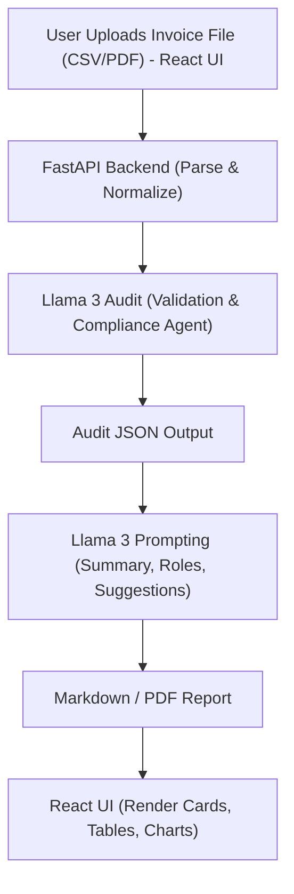

# 📟 SmartAudit LLM: Legal + Managerial + Financial Agent

## 🔍 Overview

SmartAudit LLM is an advanced, autonomous auditing platform designed to analyze and validate financial documents such as invoices in CSV and PDF formats. The system leverages a streamlined architecture that relies entirely on **Llama 3 via Groq** to handle both deep reasoning and rule-based validation, creating a cohesive and powerful auditing engine.

* **Unified LLM Intelligence**: Uses **Llama 3** (via Groq) for all tasks, including pattern detection, compliance checks, and generating natural language summaries.
* **Rule-based Logic**: Implements strict compliance and business rules to catch errors, fraud, and inconsistencies.
* **Multi-Agent Design**: Simulates three expert roles—Legal, Managerial, and Accountant—each providing specialized checks and insights.

### What It Does

1. **File Upload & Parsing**: Users upload invoice files (CSV or PDF) through a modern React frontend. The backend parses and normalizes the data into a structured format.
2. **Automated Auditing**: The FastAPI backend orchestrates the audit process. It applies rule-based checks (powered by **Llama 3**) to detect:

    - Missing or invalid legal fields (e.g., GSTIN, invoice ID)
    - Future-dated invoices
    - Vendor concentration and duplicate patterns
    - Calculation mismatches (e.g., total ≠ quantity × unit price)
    - Zero or negative values in numeric fields


3. **Role-Based Analysis**: The audit results are processed by **Llama 3** to generate specialized insights:
    - **Legal Summary**: Compliance issues, missing fields, and legal risks
    - **Manager Summary**: Vendor risks, operational patterns, and managerial suggestions
    - **Accountant Summary**: Numeric consistency, calculation errors, and accounting recommendations


4. **Visual Reporting**: The frontend displays the results as role-based markdown summaries, interactive tables, and visual dashboards. Users can export the findings as PDF or markdown reports.
5. **Extensible & Modular**: The architecture is agentic and modular, making it easy to add new rules, models, or UI features.

---

SmartAudit LLM combines the power of state-of-the-art LLMs and traditional audit logic to deliver a comprehensive, explainable, and user-friendly financial document auditing solution.

---

## 🏗️ System Architecture

SmartAudit LLM is an autonomous, multi-agent system for intelligent auditing of financial documents (CSV/PDF). It combines legal, managerial, and financial expertise using a unified Llama 3 architecture. The system features:

* **Llama 3 via Groq (Generative)**: Generates markdown summaries and role-based insights (Legal, Manager, Accountant).
* **Llama 3 via Groq (Logic)**: Performs rule-based audit logic (duplicate detection, total mismatch, compliance checks).
* **React Frontend**: User interface for uploading files, visualizing audit results, and exporting reports.
* **FastAPI Backend**: Handles file processing, audit orchestration, and API endpoints.

---

## 🚀 Features

* Upload and audit invoices in CSV or PDF format
* Automated legal, managerial, and accounting checks
* Role-based markdown summaries for easy understanding
* Visual dashboards and exportable reports
* Modular, agentic architecture for extensibility

---

## 📂 Project Structure

```text
Frontend/               # React-based frontend UI
Backend/                # FastAPI backend for coordination
parsers/                # File input and parsing logic
├── csv_parser.py
└── pdf_parser.py
sample_data/            # Sample CSV and PDF invoices for testing
llama/                  # Summary generation and prompt logic
misrtal/                 # Audit tools and rule-based logic (Llama 3 just file name)
README.md               # Project documentation
requirements.txt        # Python dependencies
test.py                 # Python test file

```

---

## 🧑‍💼 Agent Roles & Logic

### ⚖️ Legal Agent

* GST compliance checks (GST%, GSTIN format)
* Flags future invoice dates
* Identifies missing legal fields (vendor, invoice ID)

### 👔 Manager Agent

* Detects vendor concentration and high-value invoices
* Flags frequent identical amounts and repeated patterns
* Aggregates total spending per vendor

### 🧮 Accountant Agent

* Detects total mismatches (`total ≠ quantity × unit_price`)
* Flags missing/invalid numeric fields (zero/negative values)
* Ensures numerical consistency across invoices

---

## 🔄 Workflow



---

## 📦 Installation

1. **Clone the repository**
2. **Install Python dependencies:**

   ```sh
   pip install -r requirements.txt
   ```


3. **Install frontend dependencies:**

   ```sh
   cd Frontend
   npm install
   ```


4. **Set up environment variables** (see `.env.example` if provided)

---

## 🧪 Example JSON Input (to Audit Engine)

```json
[
  {
    "invoice_id": "INV-XXXX",
    "date": "YYYY-MM-DD",
    "vendor": "Vendor Name",
    "products": [
      {
        "name": "Item Name",
        "quantity": 0.0,
        "unit_price": 0.0,
        "total": 0.0
      }
    ]
  }
]

```

---

## 🧾 Example JSON Output (from Audit Engine)

```json
{
  "summary": {
    "total_invoices": 0,
    "vendors": 0,
    "date_range": {
      "start": "YYYY-MM-DD",
      "end": "YYYY-MM-DD"
    }
  },
  "issues": [
    {
      "invoice_id": "string",
      "vendor": "string",
      "issue_type": "string",
      "description": "string",
      "severity": "low | medium | high"
    }
  ],
  "compliance_flags": {
    "future_dates": [ { "invoice_id": "string", "date": "YYYY-MM-DD" } ],
    "missing_fields": [ { "invoice_id": "string", "field": "string" } ],
    "invalid_gstin": [ { "invoice_id": "string", "gstin": "string" } ]
  },
  "vendor_summary": [
    {
      "vendor": "string",
      "invoice_count": 0,
      "total_billed": 0.0
    }
  ],
  "invoice_patterns": {
    "duplicate_amounts": [ { "amount": 0.0, "invoice_ids": ["string"] } ],
    "repeated_items": [ { "item": "string", "occurrences": 0 } ]
  }
}

```

---

## 👥 Authors

* **Sourish** – Llama 3 + Summary Generator, Backend
* **Prem** – Audit Logic & Rule-based Tools
* **Parth** – Frontend (React), UI/UX
